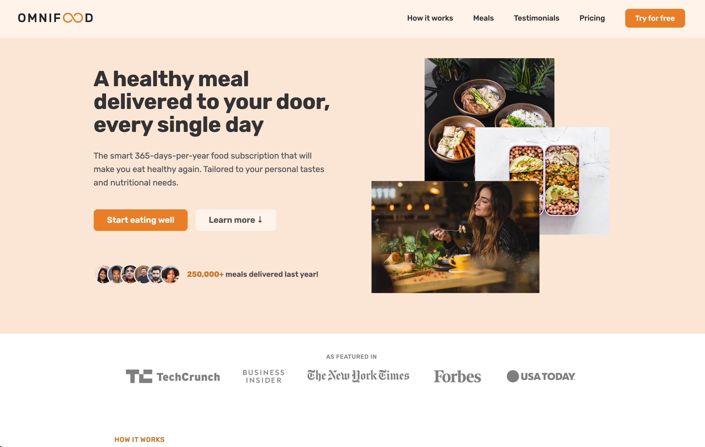

# Omnifood Landing Page

Welcome to the Omnifood landing page! This project provides a simple HTML and CSS implementation for a stunning landing page with 9 sections.

You can view the Omnifood landing page online at https://omnifood-huydev.netlify.app

## Features
- Clean and modern design
- Responsive layout for various screen sizes
- 9 customizable sections

## Table of Contents
- [Header](#header)
- [Hero](#hero)
- [Featured](#featured)
- [How it Works](#how-it-works)
- [Meals](#meals)
- [Testimonials](#testimonials)
- [Pricing](#pricing)
- [Call to Action](#call-to-action)
- [Footer](#footer)

### Header
The header section typically contains your website's logo, navigation menu.

---
### Hero
The hero section is the first thing visitors see. It often includes a headline, subheadline, and a call-to-action button.

---
### Featured
Highlight key features or offerings in this section.

---
### How it Works
Explain how your product or service works in this section.

---
### Meals
If applicable, showcase meals or products in this section.

---
### Testimonials
Display customer testimonials to build trust.

---
### Pricing
Outline your product or service pricing details.

---
### Call to Action
Encourage users to take action in this section.

---
### Footer
The footer typically contains contact information, social media links, and other important details.